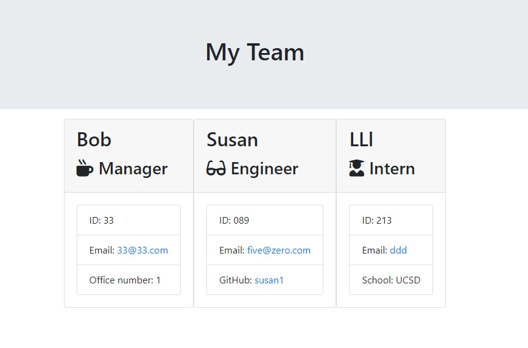

## Employee Summary Generator

## Description 

Employee summary generator is an application that will ask the user to input their team members and their roles/information, and then generate an HTML file that displays cards with all of this information nicely displayed: 

## Installation

Navigate to https://github.com/mpkahn/teamgenerator and clone repository to access app.js file located in Develop folder.
Install npm (npm i) and inquirer https://www.npmjs.com/package/inquirer as well.

## Usage 

* Open terminal/gitbash and navigate to develop folder.
* Install inquirer if not already installed https://www.npmjs.com/package/inquirer
* Run node app.js
* Follow instructions and enter inputs 
* View final html file in the "outputs" folder

Demo video: https://drive.google.com/file/d/1tgOIxl_RX77WRZNeGg227nwjBV5S30F9/view

## Testing

Type "npm run test" in terminal in order to run tests. Test script is located in the "test" folder. All tests should pass for successful function.

## Credits

node.js and its documentation on file systems https://nodejs.org/api/fs.html & https://nodejs.org/en/knowledge/file-system/how-to-write-files-in-nodejs/
npm js, specifically inquirer https://www.npmjs.com/package/inquirer
Screencastify 

## License

MIT License

Copyright (c) [2021] [Michael Kahn]

Permission is hereby granted, free of charge, to any person obtaining a copy
of this software and associated documentation files (the "Software"), to deal
in the Software without restriction, including without limitation the rights
to use, copy, modify, merge, publish, distribute, sublicense, and/or sell
copies of the Software, and to permit persons to whom the Software is
furnished to do so, subject to the following conditions:

The above copyright notice and this permission notice shall be included in all
copies or substantial portions of the Software.

THE SOFTWARE IS PROVIDED "AS IS", WITHOUT WARRANTY OF ANY KIND, EXPRESS OR
IMPLIED, INCLUDING BUT NOT LIMITED TO THE WARRANTIES OF MERCHANTABILITY,
FITNESS FOR A PARTICULAR PURPOSE AND NONINFRINGEMENT. IN NO EVENT SHALL THE
AUTHORS OR COPYRIGHT HOLDERS BE LIABLE FOR ANY CLAIM, DAMAGES OR OTHER
LIABILITY, WHETHER IN AN ACTION OF CONTRACT, TORT OR OTHERWISE, ARISING FROM,
OUT OF OR IN CONNECTION WITH THE SOFTWARE OR THE USE OR OTHER DEALINGS IN THE
SOFTWARE.